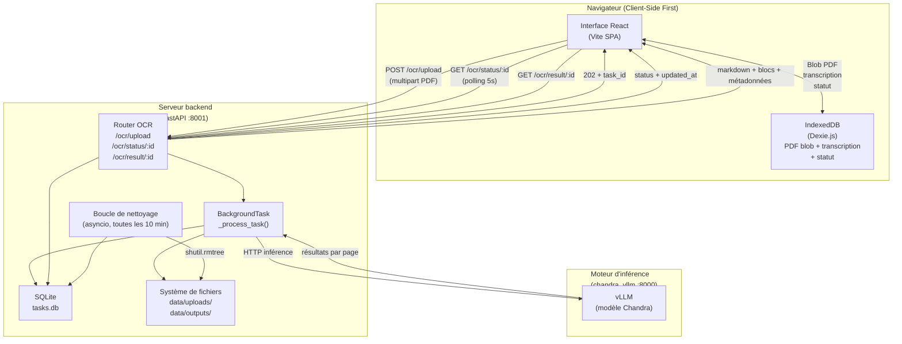
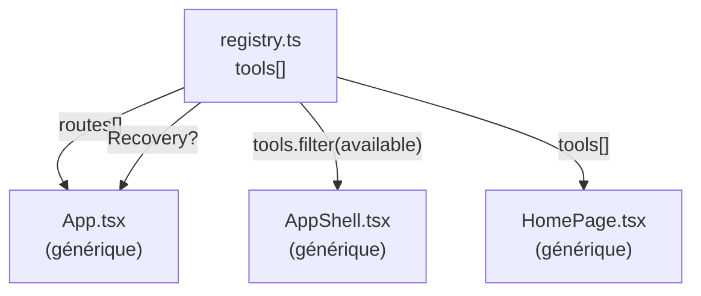
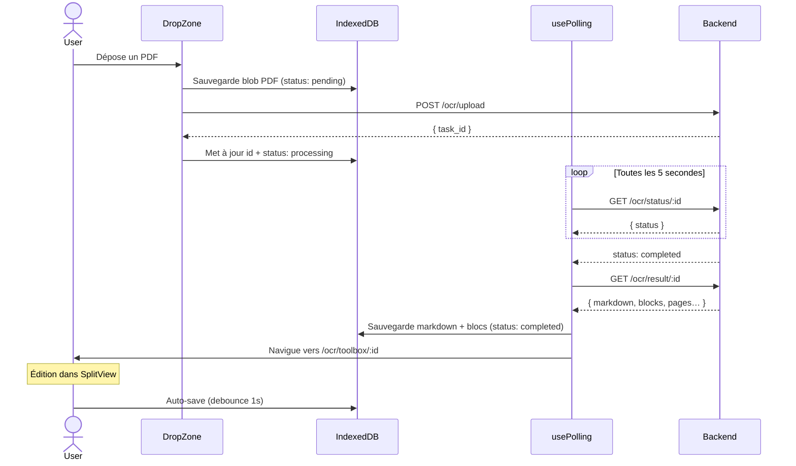
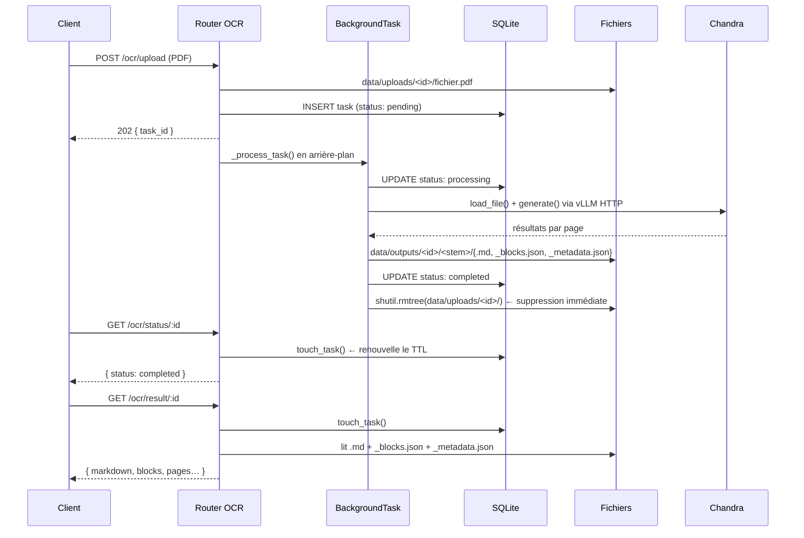
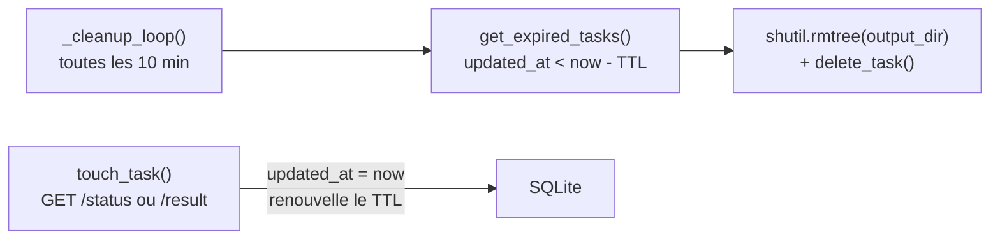
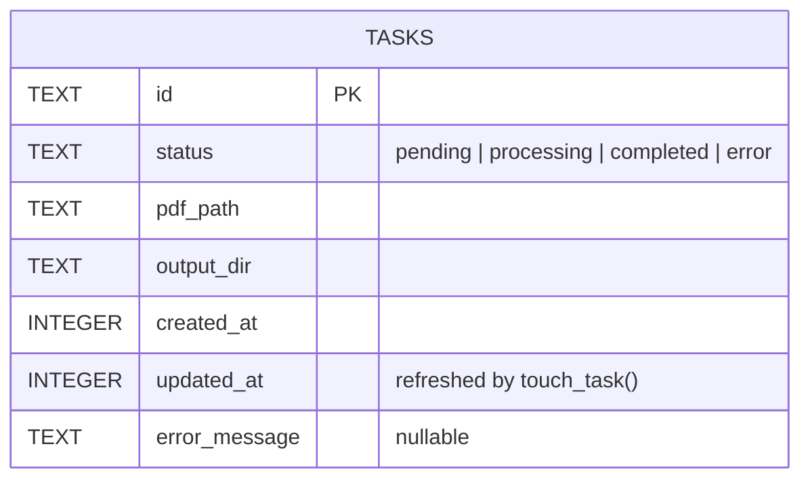

# Architecture générale — Histoolbox

Histoolbox est un monorepo composé de deux applications indépendantes qui communiquent via une API HTTP.

```
histoolbox/
├── frontend/   — React 19 + TypeScript + Tailwind 4 (Vite)
└── backend/    — Python 3.11 + FastAPI + SQLite
```

---

## Vue d'ensemble du système



---

## Frontend

### Principe fondateur : Client-Side First

Les fichiers PDF ne quittent pas le navigateur après upload. Ils sont stockés dans **IndexedDB** (Dexie.js) dès la sélection. Le backend ne reçoit le PDF que le temps du traitement ; les résultats (markdown, blocs) sont rapatriés et persistés localement.

### Système de tools (plug-in/plug-out)

Toute la navigation, les cartes d'accueil et les routes sont générées depuis un **registre central** (`src/tools/registry.ts`). Ajouter un outil = créer un fichier + ajouter une ligne dans le registre.



### Flux OCR — cycle de vie complet



### Recovery au redémarrage

Si l'utilisateur ferme le navigateur pendant un traitement, `OCRRecovery` (composant null-render monté au démarrage) vérifie l'IndexedDB et reprend le polling automatiquement.

### Structure des fichiers frontend

```
src/
├── tools/               ← POINT D'ENTRÉE pour ajouter un tool
│   ├── registry.ts      ← interface ToolDefinition + tableau tools[]
│   └── ocr.tsx          ← tool OCR (routes + OCRRecovery)
│
├── pages/
│   ├── HomePage.tsx         ← grille de cartes (générique)
│   ├── OCRUploadPage.tsx    ← drag & drop + upload
│   ├── OCRWaitingPage.tsx   ← écran d'attente + polling
│   ├── OCRToolboxPage.tsx   ← éditeur split-view
│   └── OCRHistoryPage.tsx   ← historique des traitements OCR
│
├── components/
│   ├── AppShell.tsx         ← header + nav (générique)
│   ├── SplitView.tsx        ← panneau divisé draggable
│   ├── PDFPanel.tsx         ← viewer PDF (@react-pdf-viewer)
│   ├── MarkdownEditor.tsx   ← CodeMirror 6 (source / aperçu / blocs)
│   ├── HistoryPage.tsx      ← liste historique générique
│   ├── BlockOverlay.tsx     ← overlay de blocs sur le PDF
│   └── DropZone.tsx         ← drag & drop fichier
│
├── hooks/
│   ├── usePolling.ts        ← polling /ocr/status toutes les 5s
│   └── useAutoSave.ts       ← debounce 1s → IndexedDB
│
├── lib/
│   ├── apiClient.ts         ← fetch wrapper + types partagés
│   ├── blockUtils.ts        ← navigation par blocs
│   └── exportUtils.ts       ← export .md et .docx
│
└── db/
    └── index.ts             ← Dexie.js + OCRProject + CRUD helpers
```

---

## Backend

### Principe fondateur : zéro cold-start

`InferenceManager` (Chandra) est instancié **une seule fois** au chargement du module. L'inférence est lancée via `asyncio.to_thread` pour ne pas bloquer la boucle d'événements FastAPI.

### Flux de traitement



### Nettoyage automatique (TTL)



- `CLEANUP_TTL_SECONDS` (défaut : `3600`) — inactivité avant suppression
- `CLEANUP_INTERVAL_SECONDS` (défaut : `600`) — fréquence de la boucle
- Toute lecture (`/status`, `/result`) renouvelle le TTL → une tâche activement consultée n'est jamais supprimée

### Structure des fichiers backend

```
backend/
└── app/
    ├── main.py                    ← FastAPI + lifespan + boucle de nettoyage
    ├── database.py                ← SQLite raw (sqlite3 stdlib), zéro ORM
    ├── routers/
    │   └── ocr.py                 ← endpoints POST/GET + _process_task
    ├── services/
    │   └── chandra_service.py     ← InferenceManager singleton + run_chandra()
    └── models/
        └── schemas.py             ← Pydantic : UploadResponse, StatusResponse, ResultResponse…
```

### Schéma de la base de données



---

## Communication frontend ↔ backend

| Endpoint | Sens | Description |
|---|---|---|
| `POST /ocr/upload` | → | Envoie le PDF, reçoit un `task_id` (202) |
| `GET /ocr/status/:id` | → | Interroge le statut ; renouvelle le TTL |
| `GET /ocr/result/:id` | → | Récupère markdown + blocs (409 si pas completed) |

Toutes les URLs sont **relatives** côté frontend. Le proxy Vite (`/ocr/*` → `http://localhost:8001`) est actif en développement.

---

## Décisions techniques clés

| Décision | Raison |
|---|---|
| IndexedDB (Dexie.js) pour les PDF | Blob lourd — ne pas l'envoyer au serveur à chaque refresh |
| Polling HTTP (pas WebSocket) | Simple, compatible avec tous les proxies, suffisant pour un TTL de plusieurs heures |
| SQLite sans ORM | Zéro dépendance, schéma trivial (1 table), performances largement suffisantes |
| `asyncio.to_thread` pour Chandra | Inférence CPU/GPU bloquante — ne doit pas geler la boucle d'événements |
| `shutil.rmtree(ignore_errors=True)` | Idempotent — la suppression ne lève pas d'exception si les fichiers ont déjà disparu |
| `touch_task()` sur chaque lecture | Le client contrôle implicitement la durée de vie de ses données en continuant à poller |
